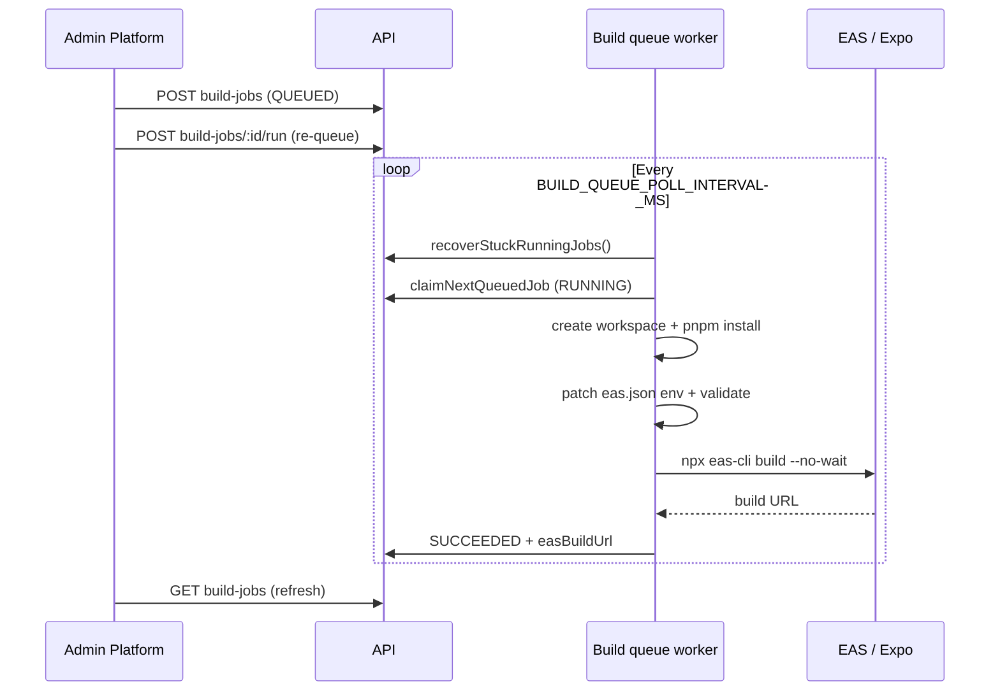

# White-label EAS builds (GymOS)

FraterUnion operators queue white-label mobile builds from **Admin → Platform**. The API runs an async worker that prepares a temporary monorepo workspace, submits to **Expo Application Services (EAS)** with `--no-wait`, and stores the Expo build URL on the job record.

This does **not** publish to the App Store or Google Play.

## Build flow



1. **Queue** — Operator saves mobile config on the studio, then **Generate build** (or **Enqueue** on a failed job).
2. **Claim** — Worker atomically picks the oldest `QUEUED` job (`FOR UPDATE SKIP LOCKED`).
3. **Workspace** — Copies `apps/mobile` + workspace packages, runs `pnpm install`, initializes git (EAS requirement).
4. **Env** — Injects per-tenant values into the EAS profile `env` block in `eas.json` (required for remote Metro).
5. **Submit** — `npx eas-cli build --platform ios|android --profile preview|production --non-interactive --no-wait`.
6. **Complete** — Job moves to `SUCCEEDED` with `easBuildUrl` (and optional `artifactUrl` if CLI returns one). Finish the install on [expo.dev](https://expo.dev).

## Required API environment variables

| Variable | Required when worker on | Description |
|----------|-------------------------|-------------|
| `BUILD_WORKER_ENABLED` | Yes | Must be `true` for the queue worker to run builds. |
| `EAS_ACCESS_TOKEN` | Yes | Expo access token (`EXPO_TOKEN` for CLI). Never log or return to clients. |
| `EXPO_PUBLIC_API_URL` | Yes* | **API origin only** (see contract below). Falls back to first `CORS_ORIGIN` if unset. |
| `MOBILE_APP_ROOT` | No | Override path to `apps/mobile` if cwd detection fails. |
| `EAS_PROJECT_ID` | No | Optional Expo project hints. |
| `EAS_PROJECT_SLUG` | No | Optional. |
| `EAS_ACCOUNT_NAME` | No | Optional. |
| `BUILD_QUEUE_POLL_INTERVAL_MS` | No | 30000–120000, default 45000. |
| `EAS_BUILD_TIMEOUT_MS` | No | CLI submit timeout, default 600000 (max 1800000). |
| `BUILD_WORKER_DIAGNOSTICS_TIMEOUT_MS` | No | Worker-info probe timeout, default 20000. |
| `DEBUG_KEEP_BUILD_WORKSPACE` | No | `true` skips temp dir cleanup (debug only). |
| `BUNDLE_DEFAULT_*_PATH` | No | Default icon/splash paths for builds. |

\*Or a valid first origin in `CORS_ORIGIN`.

Check readiness: `GET /api/v1/studios/:studioId/build-jobs/worker-info` (platform operators). Admin **Platform → Worker readiness** mirrors this.

## EXPO_PUBLIC_API_URL contract

**Must be the API origin only — no path suffix.**

| Correct | Incorrect |
|---------|-----------|
| `https://api.example.com` | `https://api.example.com/api/v1` |

The mobile app appends `/api/v1/...` at runtime. If `EXPO_PUBLIC_API_URL` already includes `/api/v1`, requests become **double-prefixed** (`/api/v1/api/v1/...`).

The build worker strips a trailing `/api/v1` if misconfigured and logs `api_url_sanitized` when that happens.

Branding URL baked into the bundle:

`{EXPO_PUBLIC_API_URL}/api/v1/public/studios/{studioSlug}/branding`

## BuildJob fields (Phase 16+)

| Field | Meaning |
|-------|---------|
| `submittedAt` | When EAS accepted the build (URL captured). |
| `expoBuildId` | Parsed from Expo build URL when available. |
| `expoBuildStatus` | e.g. `SUBMITTED` after successful CLI submit. |
| `lastCheckedAt` | Last worker touch / recovery check. |
| `errorCategory` | `CONFIG_ERROR`, `AUTH_ERROR`, `EAS_OUTAGE`, `BUILD_FAILED`, `TIMEOUT`, `UNKNOWN`. |

## Stuck RUNNING recovery

Each poll, before claiming new work:

- `RUNNING` + `startedAt` older than **30 minutes** + **no** `easBuildUrl` → `FAILED` with `errorCategory=TIMEOUT`.
- Jobs that already have `easBuildUrl` are **not** failed (submitted to Expo; may still be building there).

## Railway deployment

### Watch paths

Configure Railway so **API** redeploys when build-related code changes, for example:

- `apps/api/**`
- `apps/mobile/**` (eas.json, app.config.js — worker copies this tree)
- `packages/**` (workspace deps for mobile)
- `pnpm-lock.yaml`
- `pnpm-workspace.yaml`

Admin-only changes (`apps/admin/**`) do not require an API redeploy unless API contracts change.

### Service layout

- Deploy the **monorepo** (or ensure `MOBILE_APP_ROOT` points at `apps/mobile` with `eas.json`).
- Set env vars above on the **API** service.
- Use **Platform → Worker readiness** until `canExecuteBuilds` is green before enabling production traffic.

### Logs

Structured JSON events (no secrets):

- `build_job_claimed`, `workspace_created`, `pre_build_validation_passed`
- `eas_submitted`, `eas_build_url_captured`, `workspace_cleaned`
- `build_job_succeeded`, `build_job_failed`, `build_jobs_stuck_recovered`

## Troubleshooting

| Symptom | Likely cause | Action |
|---------|----------------|--------|
| Jobs stay `QUEUED` | `BUILD_WORKER_ENABLED=false` or readiness failing | Fix worker-info blockers; set `BUILD_WORKER_ENABLED=true`. |
| `CONFIG_ERROR` / pre-build validation | Bad `EXPO_PUBLIC_API_URL` or missing eas.json env | Use origin-only API URL; check Platform mobile config saved. |
| `AUTH_ERROR` | Invalid or missing `EAS_ACCESS_TOKEN` | Rotate token in Expo dashboard; update Railway env. |
| `TIMEOUT` after 30m, no URL | Workspace/install/submit hung | Check API logs for `dependency_install_failed` or CLI exit code; increase `EAS_BUILD_TIMEOUT_MS` if submit is slow. |
| `Cannot find module 'dotenv'` | Old `app.config.js` on worker | Ensure `apps/mobile/app.config.js` uses built-in env loader (no `dotenv` package). |
| Double `/api/v1` in app | `EXPO_PUBLIC_API_URL` includes path | Set origin-only URL on API host. |
| Build succeeds in Expo but job `FAILED` locally | CLI exit non-zero despite URL | Check stderr in `errorMessage`; may need CLI flag/output parsing tweak. |

## Local validation (mobile only)

```bash
cd apps/mobile
WHITELABEL_PROFILE=ares npx expo config --json
WHITELABEL_PROFILE=ares npx expo export --platform android
```

## API endpoints (operators)

| Method | Path |
|--------|------|
| GET | `/api/v1/studios/:studioId/build-jobs/worker-info` |
| GET | `/api/v1/studios/:studioId/build-jobs` |
| GET | `/api/v1/studios/:studioId/build-jobs/:jobId` |
| POST | `/api/v1/studios/:studioId/build-jobs` |
| POST | `/api/v1/studios/:studioId/build-jobs/:jobId/run` |
